# Langlez Backend — 이벤트 카탈로그

**어느 모듈이 무슨 이벤트를 내고, 누가 받고, 받아서 무엇을 하는가.**

Kafka(모듈 간 상태 전파)와 Redis pub/sub(접속 중인 사용자에게 실시간 전달) 두 갈래를 다룬다.
모듈 구조·계층 규약은 `CLAUDE.md`, 구현 규약은 `module/CLAUDE.md`, 현황은 `README.md` 를 본다.

**실제 코드에서 뽑았다. 코드와 어긋나면 코드가 정답이다.**

---

## 1. 한눈에

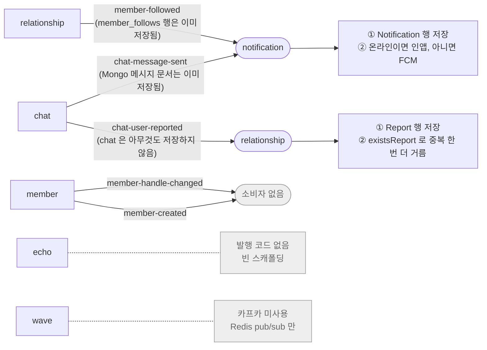

**읽는 법 두 가지가 갈린다.**

- `member-followed` 와 `chat-message-sent` 는 **이미 저장된 것에 대한 알림**이다. 발행 모듈이 트랜잭션 안에서 원본 데이터를 저장하고, 이벤트는 그 결과다. 수신 모듈은 `Notification` 만 만든다 — 팔로우 관계나 메시지 본문을 다시 저장하지 않는다.
- `chat-user-reported` 만 반대다. chat 은 **접수 사실만 알리고 아무것도 저장하지 않는다.** `Report` 를 만드는 건 relationship 이다 — 신고 데이터는 relationship 소유이기 때문이다.

듣는 쪽은 **notification 과 relationship 둘뿐이다.**

---

## 2. Kafka 이벤트

### `chat-message-sent`

> chat ──▶ **notification**

| | |
|---|---|
| **발행** | `ChatMessagePublisher` — 1초마다 Mongo 의 미발행 메시지를 잡아 발행 |
| **페이로드** | `ChatMessageSentEvent(roomId, messageId, senderId, recipientId, preview)` |
| **파티션 키** | 없음 |
| **멱등 키** | `messageId` |

**발행 조건이 붙어 있다.** 발행 직전에 수신자가 그 방을 보고 있는지 확인해서, 보고 있으면 **아예 안 낸다.** 메시지는 이미 WebSocket 으로 화면에 떴는데 그 위에 푸시를 겹치면 같은 내용을 두 번 보게 된다.

**notification 이 받아서 하는 일**

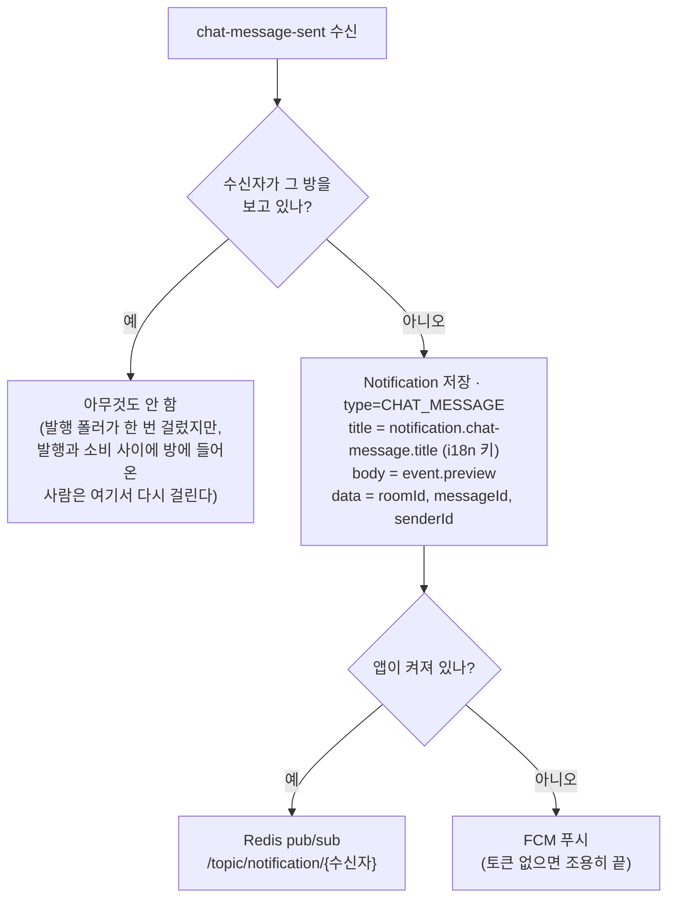

이력을 **먼저** 남기고 전달한다. 전달이 실패해도 알림함에는 남아야 한다.

---

### `chat-user-reported`

> chat ──▶ **relationship**

| | |
|---|---|
| **발행** | `ChatEventListener` → `chat_event_outbox` → `ChatOutBoxScheduler`(2초) |
| **페이로드** | `ChatUserReportedEvent(roomId, reporterId, reportedUserId, reason, triggerMessageId)` |
| **파티션 키** | `roomId` |
| **멱등 키** | 페이로드 전체 (고유 id 가 없다) |

chat 은 **신고 접수 사실만 알린다.** `Report` 를 저장하는 건 relationship 이다 — 신고 데이터는 relationship 소유다.

**relationship 이 받아서 하는 일**

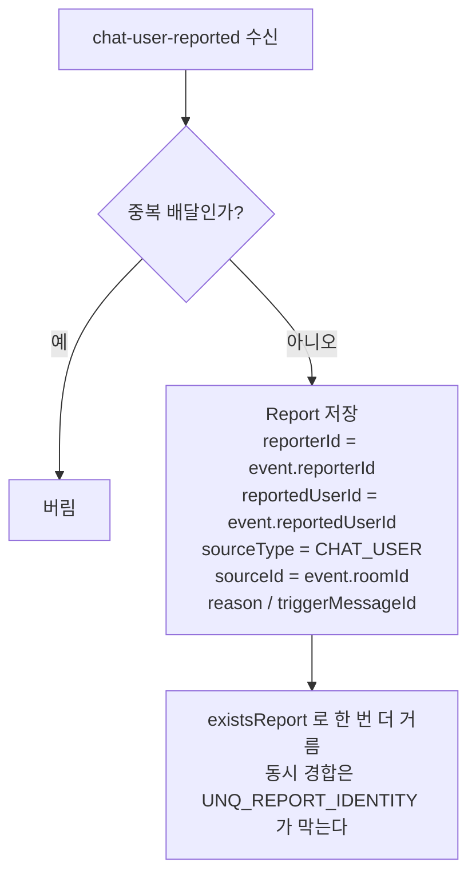

방 id 를 `sourceId` 로 남겨야 운영이 "어느 대화에서 벌어진 일인지" 추적한다.

---

### `member-followed`

> relationship ──▶ **notification**

| | |
|---|---|
| **발행** | `RelationshipEventListener` → `relationship_event_outbox` → `RelationshipOutBoxScheduler`(2초) |
| **페이로드** | `MemberFollowedEvent(followId, followerId, followedId)` |
| **파티션 키** | `followedId` — 한 사람에 대한 이벤트 순서 보장 |
| **멱등 키** | `followId` |

**팔로우 관계는 발행 전에 이미 저장돼 있다.** `RelationshipService.follow()` 가 한 트랜잭션 안에서 순서대로 한다.

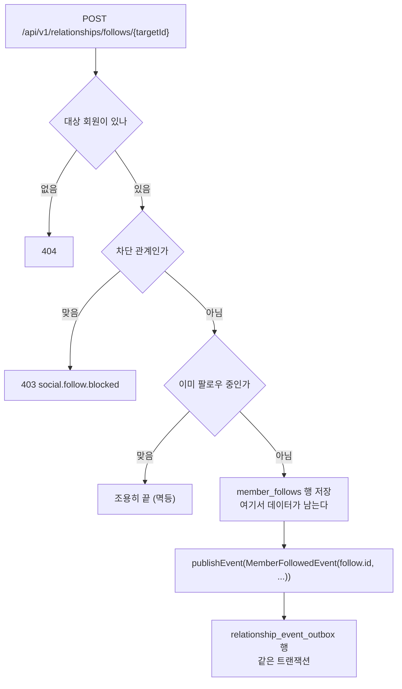

`followId` 를 실을 수 있는 것도 이 순서 덕이다 — 저장이 끝나야 행 id 가 나온다.

`followId` 가 들어 있는 이유: `(followerId, followedId)` 만으로 키를 잡으면 **언팔로우 후 재팔로우가 같은 값**이라 정상 알림이 막힌다. `Follow` 행은 매번 새 id 를 받는다.

**notification 이 받아서 하는 일**

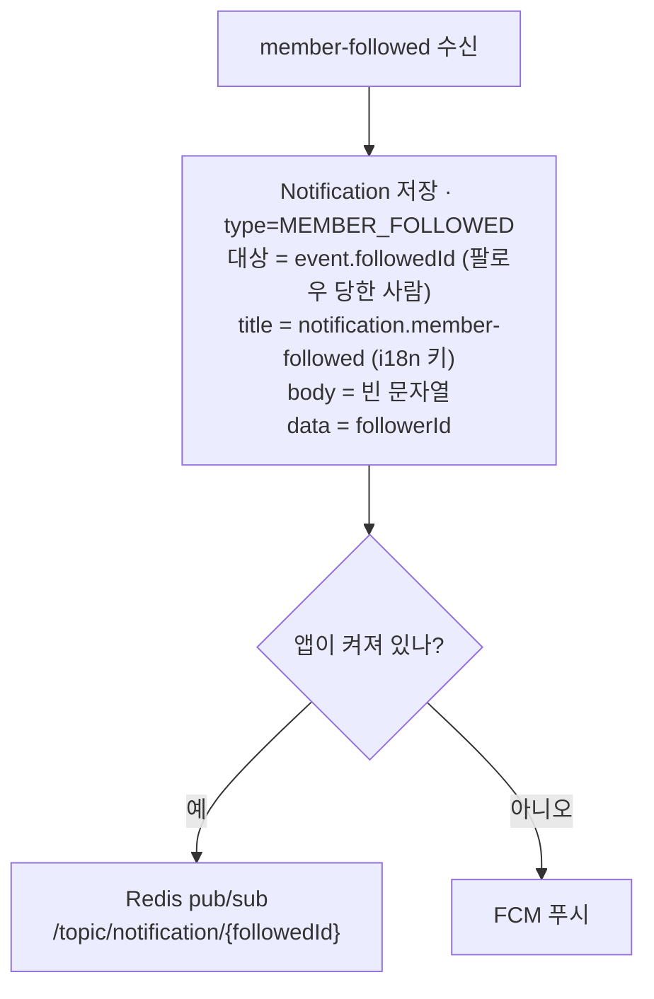

**notification 은 팔로우 관계를 저장하지 않는다.** 알림만 만든다. 팔로우 그래프는 relationship 소유고, 다른 모듈은 `core.FollowQuery` 포트로 조회한다.

**언팔로우 이벤트는 없다.** `unfollow` 는 `member_follows` 행만 지우고 이벤트를 내지 않는다. 지금 소비할 데가 없다.

---

### `member-created` · `member-handle-changed`

> member ──▶ **(소비자 없음)**

| | |
|---|---|
| **발행** | `MemberEventListener` → `member_event_outbox` → `MemberOutBoxScheduler`(2초) |
| **페이로드** | `MemberCreatedEvent`, `MemberHandleChangedEvent` |
| **파티션 키** | `memberId` |

**발행은 되는데 아무도 안 듣는다.** 저장소 전체에 `@KafkaListener` 가 3개뿐이고 이 두 토픽을 받는 건 없다. 소비처가 생길 때까지 브로커에 쌓이기만 한다.

---

### 발행되지 않는 것들

| 대상 | 상태 |
|---|---|
| `core/event/echo/EchoPostLikedEvent` | DTO 만 있고 발행하는 코드가 없다 |
| `core/event/echo/EchoCommentCreatedEvent` | 〃 |
| `echo_event_outbox` (+ 엔티티·저장소) | 쓰는 코드도 스케줄러도 없는 빈 스캐폴딩 |

좋아요·댓글이 알림으로 이어지지 않는다.

---

## 3. Redis pub/sub — 실시간 전달

STOMP 브로커가 인메모리라 **자기 JVM 에 붙은 세션에만** 전달한다. 인스턴스가 여러 대면 다른 서버에 붙은 상대가 못 받는다. Redis pub/sub 이 그 간극을 메운다.

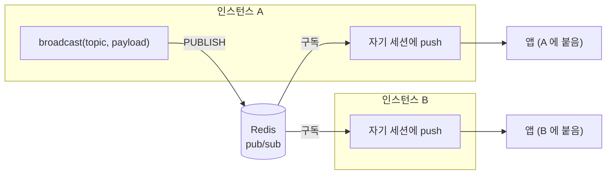

**서비스 코드는 `SimpMessagingTemplate` 이 아니라 `core.MessageBroadcaster` 포트를 쓴다.** 직접 쓰면 다중 인스턴스에서 조용히 깨진다.

### 토픽 목록

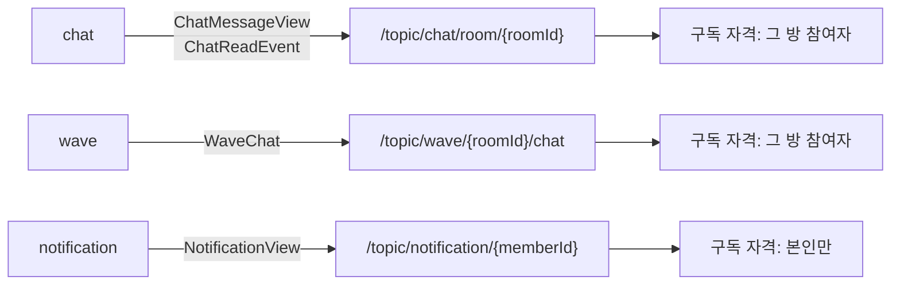

### `/topic/chat/room/{roomId}`

> chat 발행 · 그 방 참여자가 구독

세 가지 상황에서 나간다.

| 상황 | 페이로드 | 받는 쪽이 하는 일 |
|---|---|---|
| 메시지 전송 | `ChatMessageView` | 새 메시지를 화면에 붙인다 |
| 읽음 처리 | `ChatReadEvent(roomId, memberId, readAt)` | 상대의 "읽음" 표시를 갱신한다 |
| 메시지 삭제 | `ChatMessageView` (삭제 상태로) | 그 메시지를 삭제 표시로 바꾼다 |

메시지 전송은 **두 갈래로 동시에 나간다.**

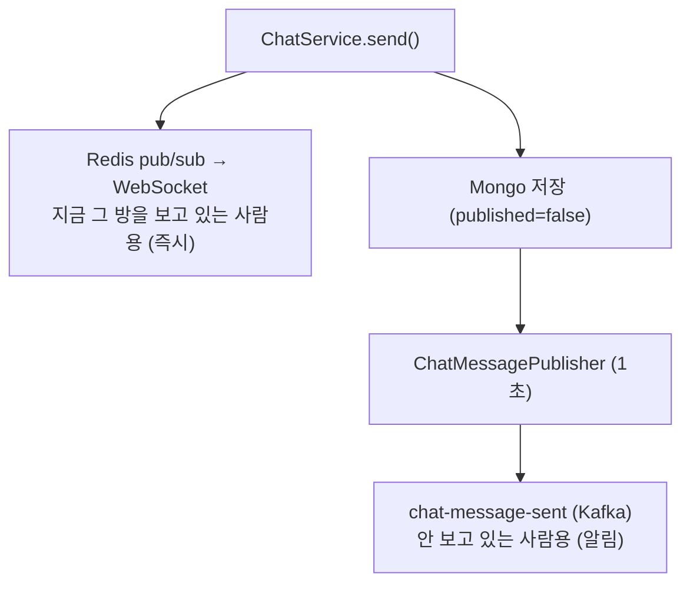

### `/topic/wave/{roomId}/chat`

> wave 발행 · 그 방 참여자가 구독

음성방의 사라지는 채팅. `WaveChat(roomId, senderId, content)` 을 Redis 링버퍼에 넣고 같은 내용을 브로드캐스트한다. **DB 에 저장하지 않는다.**

### `/topic/notification/{memberId}`

> notification 발행 · 본인만 구독

Kafka 이벤트를 처리한 결과가 여기로 나간다. **수신자가 온라인일 때만** 발행하고, 오프라인이면 FCM 으로 대체한다 — 둘 다 보내면 같은 알림이 두 번 뜬다.

페이로드는 `NotificationView`(저장된 `Notification` + `data`).

### 구독 인가는 기본 거부다

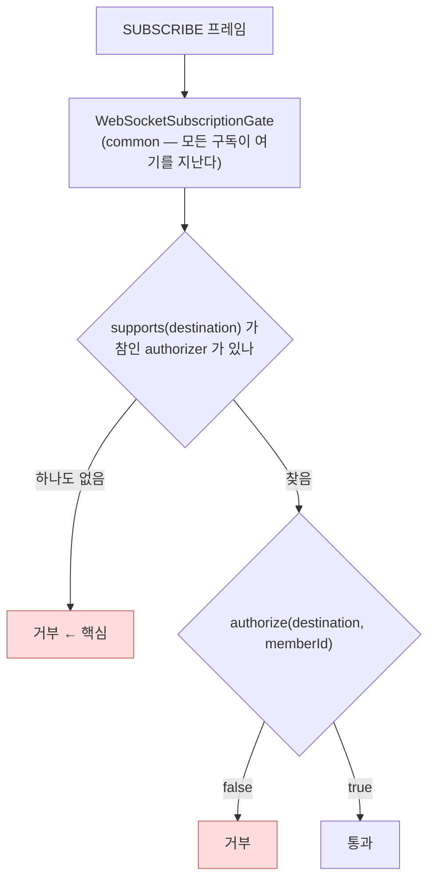

| 목적지 | 판정하는 곳 | 조건 |
|---|---|---|
| `/topic/chat/room/{roomId}` | `ChatSubscriptionAuthorizer` | 그 방 참여자인가 |
| `/topic/wave/{roomId}/chat` | `WaveSubscriptionAuthorizer` | 그 방 참여자인가 |
| `/topic/notification/{memberId}` | `NotificationSubscriptionAuthorizer` | 본인인가 |

새 실시간 토픽을 만들면 `{Domain}SubscriptionAuthorizer` 를 `@Component` 로 추가하는 게 전부다. **인터셉터를 새로 달지 않는다** — 다는 순간 "내 접두사가 아니면 통과"가 생기고 아무도 책임지지 않는 목적지가 다시 열린다.

목적지는 **끝을 고정한 정규식**(`^/topic/chat/room/(\d+)$`)으로만 통과시킨다. 심플 브로커는 구독 목적지에 별표 와일드카드를 허용해서, 방 번호 자리를 느슨하게 열면 전체 방을 한 번에 빨아간다.

---

## 4. Kafka 를 안 타는 것들

| 신호 | 수단 | 이유 |
|---|---|---|
| 접속 핑 (5초 간격) | Redis 버킷 직결 | 고빈도·저가치. 브로커 왕복 비용이 가치보다 크다 |
| 화면 보는 중 상태 | Redis | 휘발성 |
| 팔로우 그래프 조회 | `core.FollowQuery` 포트 | 이벤트로 복제하면 두 벌이 어긋난다. 언팔로우 이벤트도 없어 복제본은 늘기만 한다 |
| 차단 여부 판정 | `core.BlockQuery` 포트 | 〃 |
| 회원 상태 조회 | `core.MemberStatusQuery` 포트 | 매 요청 필요. 응답을 기다려야 한다 |

**응답을 기다려야 하는 조회는 `core` 포트, 상태 변경 전파는 Kafka** 가 기준선이다.

---

## 5. 발행 경로 두 가지

### 아웃박스 (기본)

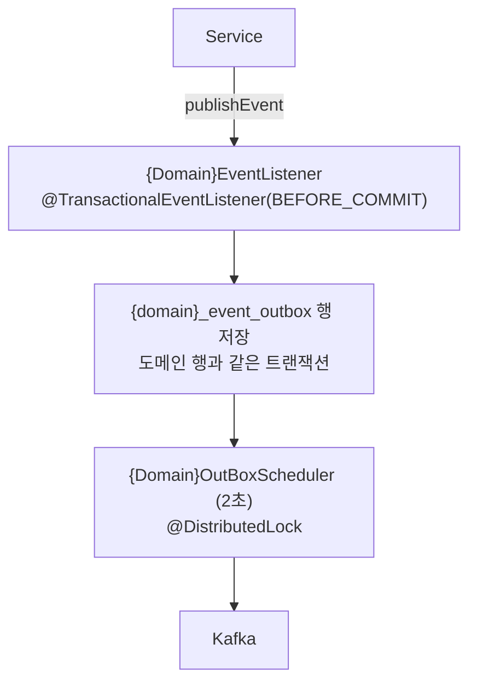

도메인 행과 아웃박스 행이 함께 커밋되거나 함께 롤백된다. "저장은 됐는데 이벤트는 유실"이 원천 차단된다.

### `published` 플래그 (채팅 메시지 전용)

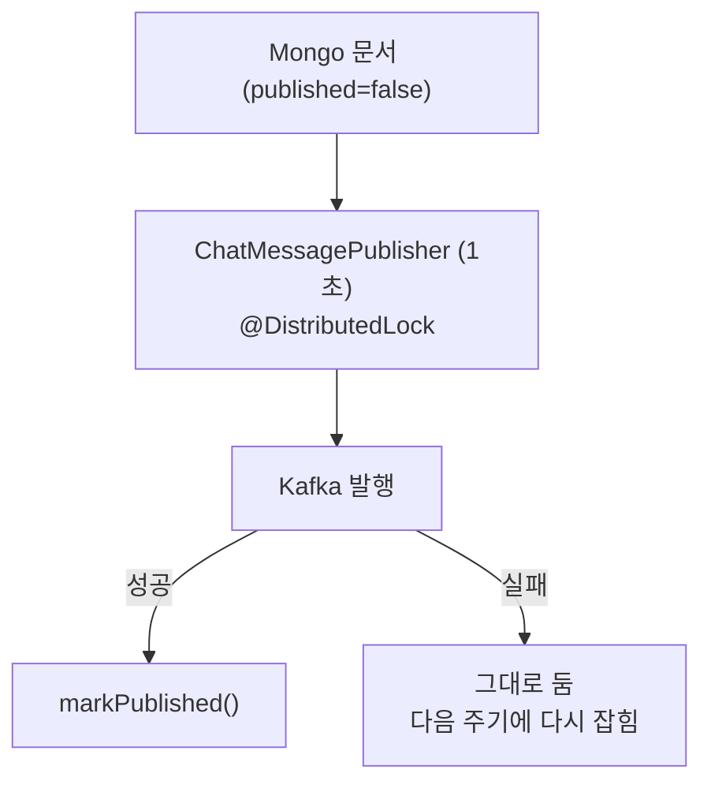

가장 빈번한 쓰기라 별도 아웃박스 행을 만들면 쓰기가 그대로 두 배가 된다.

---

## 6. 새 이벤트를 추가할 때

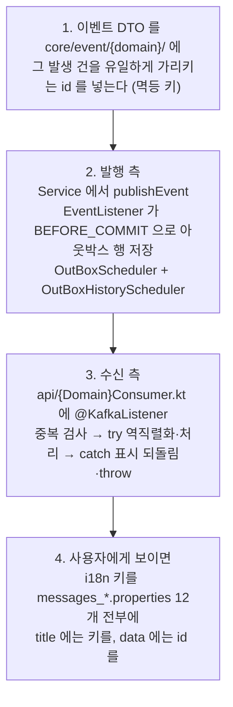

**빠뜨리기 쉬운 것**

- 아웃박스 행만 만들고 **스케줄러를 안 만들면** 테이블에 쌓이기만 하고 한 건도 안 나간다
- 발행만 하고 **소비자를 안 만들면** 브로커에 쌓이기만 한다 (`member-created` 가 지금 그렇다)
- **이벤트에 고유 id 가 없으면** 같은 내용의 두 사건이 하나로 합쳐진다
- 역직렬화를 `try` 밖에 두면 깨진 페이로드가 왔을 때 중복 표시가 남은 채 예외가 나가 **그 메시지가 영영 사라진다**
- i18n 키를 빠뜨리면 **키 문자열이 그대로 사용자에게 나간다**

---

## 7. 지금 비어 있거나 열려 있는 것

| 무엇 | 상태 |
|---|---|
| `member-created` · `member-handle-changed` | 발행되지만 소비자 없음 |
| echo 이벤트 배선 | DTO·아웃박스만 있고 발행 코드 없음 |
| `chat` · `echo` 히스토리 이관 스케줄러 | 없음 — 완료 행이 아웃박스 테이블에 영원히 남는다 |
| `*_outbox_history` 정리 배치 | **아예 없음** — 무한 증가 |
| `existsReport` | 유니크 제약이 없는 check-then-insert. 동시 요청에 뚫린다 |
| FCM 제목 | i18n 키 원문(`notification.member-followed`)이 OS 배너에 그대로 뜬다 |
| 컨슈머 중복 표시 | 강제 종료(SIGKILL·OOM) 시 표시만 남아 TTL(1시간)까지 재배달이 걸러진다 |
| 알림 `title` 키 명명 | chat 은 `notification.chat-message.title`, 팔로우는 `notification.member-followed` — 접미사 규칙이 어긋난다 |
