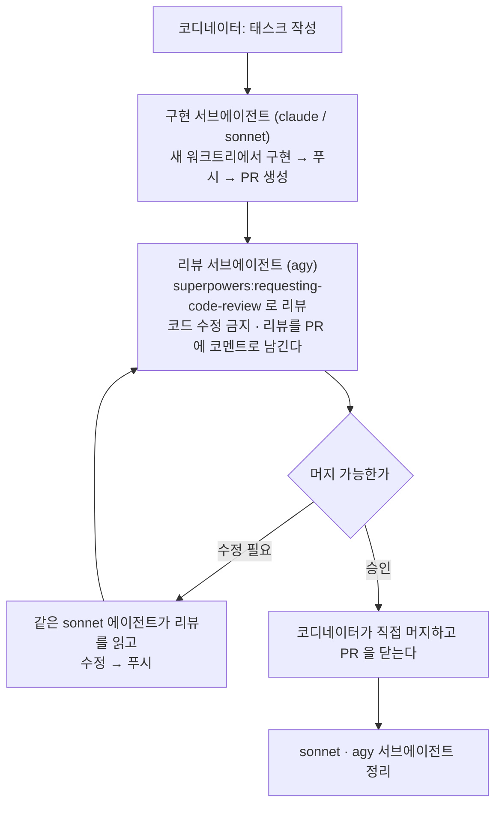

# Langlez Backend

Kotlin / Spring Boot 3.5.8 멀티모듈 백엔드. 언어교환 모바일 앱(iOS/Android)의 서버.

`module/member` 가 이 프로젝트의 **기준 모듈(reference module)** 이다. 새 모듈을 만들거나 기존 모듈을 고칠 때 member 모듈의 구조와 관례를 그대로 따른다. 이 문서는 member 모듈의 실제 코드에서 역으로 추출했고, **문서와 코드가 어긋나면 member 모듈 코드가 정답**이다.

이 문서는 **어느 파일을 고치든 항상 적용되는 것**만 담는다. 도메인 모듈(`module/*`)의 4계층 구현 규약 — 엔티티·저장소·서비스·API·비동기·마이그레이션·i18n·테스트·새 모듈 체크리스트 — 은 **`module/CLAUDE.md`** 에 있다. `module/` 하위 파일을 건드릴 때 자동으로 딸려오지만, **새 모듈을 만들 때처럼 아직 그 아래 파일을 연 적이 없다면 먼저 읽는다.**

현황과 남은 작업은 `README.md` 를 본다.

---

## 0. 시작 전에 알아야 할 것

- **모바일 전용이다.** 쿠키를 쓰지 않는다. 토큰은 헤더로만 오간다.
- **1인 1기기 정책.** `X-Device-Id` 헤더가 필수고, 다른 기기로 로그인하면 기존 세션이 끊긴다.
- **`ddl-auto: validate`.** 스키마 변경은 Flyway 로만 한다. 엔티티와 마이그레이션이 어긋나면 기동 시점에 죽는다.
- **`open-in-view: false`.** 트랜잭션 밖에서 LAZY 연관을 만지면 터진다.
- **탈퇴 회원 데이터는 지우지 않는다.** 익명화도 안 한다. 재가입 후 같은 문제를 반복하는 회원 추적이 목적인 의도된 정책이다.

### 검증

```bash
./local-infra-start.sh                               # 로컬 인프라 (Postgres·Redis·Kafka·모니터링). mongodb 는 제외돼 있다
./gradlew build                                      # 전체 빌드 + 테스트. Testcontainers 를 쓰므로 Docker 필요
./gradlew :app:api:bootRun                           # 앱 실행. 인프라 기동이 선행돼야 한다
./gradlew :module:<name>:test --tests "*MemberTest"  # 모듈별 / 단일 클래스 테스트
./gradlew compileKotlin compileTestKotlin            # 컴파일만 빠르게 확인
```

**린트 단계가 없다.** ktlint/detekt 를 붙이지 않았으니 린트 태스크가 있다고 가정하지 않는다.

---

## 1. 모듈 구조

```
core            프레임워크 없는 순수 계약 (포트 인터페이스 + 이벤트 DTO). 의존성 0
common          웹·보안·예외·필터·i18n 공용
infra/rdb       JPA + QueryDSL + Outbox 베이스 + Flyway
infra/redis     Redisson, 캐시 어댑터, 분산 락, pub/sub 브로드캐스터
infra/kafka     프로듀서·컨슈머 설정, DLT
module/*        도메인 모듈 (api / application / domain / infrastructure 4계층)
app/api         조립 + 실행
```

`settings.gradle.kts` 가 `infra/`·`module/` 하위를 자동 스캔한다. `build.gradle.kts` 만 만들면 서브프로젝트로 등록된다.

**등록만으로는 앱이 그 모듈을 로드하지 않는다.** `app/api/build.gradle.kts` 에 `implementation(project(":module:<name>"))` 을 직접 추가해야 한다. 빠뜨려도 컴파일과 모듈 단위 테스트는 통과하므로 조용히 넘어간다.

### 4계층

모든 도메인 모듈은 아래 4계층을 갖는다. 계층 이름과 depth 를 임의로 바꾸지 않는다.

```
module/member/src/main/kotlin/com/langlez/member/
├── api/                        # 외부 진입점 (HTTP, Kafka, 애플리케이션 이벤트)
│   ├── MemberAPI.kt            # Swagger 문서 전용 인터페이스
│   ├── MemberController.kt     # MemberAPI 구현, Spring MVC 매핑만
│   ├── MemberPingController.kt # 접속 핑 (레디스 직결)
│   ├── MemberEventListener.kt  # @TransactionalEventListener → Outbox 기록
│   ├── request/                # 요청 DTO
│   └── response/               # 응답 DTO
├── application/                # 유스케이스 조합, 트랜잭션 경계
├── domain/                     # 엔티티 + 저장소 포트(인터페이스)
│   ├── Member.kt
│   └── MemberRepository.kt     # 인터페이스 (구현체 없음)
└── infrastructure/             # 포트의 구현(어댑터)
    ├── MemberRepositoryImpl.kt
    ├── jpa/                    # Spring Data 인터페이스만
    └── outbox/                 # Outbox 엔티티 + 스케줄러
```

**의존 방향은 한쪽으로만 흐른다.**

```
api ──▶ application ──▶ domain ◀── infrastructure
```

- `domain` 은 다른 계층을 import 하지 않는다. 프레임워크 의존은 영속성/감사 애노테이션(`@Entity`, `@CreatedDate`, `AuditingEntityListener`)까지만. 웹/HTTP 타입(`HttpStatus`, `LanglezException`)은 넣지 않는다 — 불변식은 `require` 로 던지고 변환은 application 이 한다.
- `application` 은 `domain` 의 포트 인터페이스만 안다. `infrastructure` 구현 클래스를 직접 참조하지 않는다.
- `infrastructure` 가 `domain` 인터페이스를 구현하며 방향을 뒤집는다.
- 모듈 간에는 서로를 직접 참조하지 않는다. `core` 의 포트와 이벤트를 거친다.

### 모듈 간 통신 수단 선택

| 목적 | 수단 |
|---|---|
| 모듈 간 상태 변경 전파, 유실되면 안 되는 것 | **Kafka** (아웃박스 경유) |
| 응답을 기다려야 하는 조회 | **`core` 포트** |
| 접속 중인 사용자에게 실시간 전달 | **`core.MessageBroadcaster`** → Redis pub/sub → WebSocket |
| 고빈도 하트비트 | **Redis 직결** (Kafka 금지) |

고빈도·저가치 신호를 브로커에 태우면 비용만 든다. 접속 핑(5초 간격)이 그랬다 — 브로커 왕복에 handle→id 조회까지 붙어 있었다. 지금은 `MemberPingController` 가 레디스 버킷에 바로 쓴다.

현재 `core` 포트: `BlockQuery`, `FollowQuery`, `PushTokenQuery`, `MemberStatusQuery`, `Storage`, `OnlineTracker`, `CacheProvider`, `Notificator`, `MessageBroadcaster`, `TokenBlacklist`, `SubscriptionAuthorizer`.

### 저장소 분담

| 데이터 | 저장소 | 이유 |
|---|---|---|
| 회원·프로필·방·참여자·아웃박스 | PostgreSQL | 조인·트랜잭션 필요, 유한 증가 |
| 채팅 메시지 본문 + 첨부 | MongoDB | 무한 증가, 첨부 임베드로 조회 1회 |
| 접속·화면 상태·분산 락·캐시·wave 채팅 | Redis | 휘발성·고빈도 |

### 설정과 로깅

**설정은 `app/api/src/main/resources/` 두 파일에만 둔다.** `application.yml`(기본값이자 로컬용, `docker/` 인프라 설정과 짝을 맞춘다. 여기 든 로컬 dummy 시크릿은 운영에서 안 쓰이므로 커밋해도 된다)과 `application-production.yml`(운영용, 민감값은 전부 `${ENV_VAR}` 주입). `module/*`, `infra/*`, `common/*` 에 `application.yml` 을 만들지 않는다 — 기본값이 필요하면 `@Value`/`@ConfigurationProperties` 로 코드에 둔다.

**보안에 직결되는 설정값에 `@Value("${key:fallback}")` 같은 조용한 기본값을 넣지 않는다.** 운영에서 프로퍼티가 빠져도 기본값으로 부팅해 문제를 숨긴다. 프로덕션 코드는 필수값으로 두고, 부분 컨텍스트만 띄우는 통합테스트가 `@SpringBootTest(properties = [...])` 로 명시적으로 넣는다.

쿼리 로깅은 `common/.../logger/PerformanceLogger` 한 곳을 통해 나간다 (현재는 P6Spy(RDB)만). 임계값은 `logger.rdb/mongo/redis.{log-threshold-ms, warn-threshold-ms}`, **`warn-threshold` 이상만 `WARN` 이고 나머지는 `DEBUG`** — 일반 쿼리 로그를 INFO 로 올리면 콘솔이 스케줄러 로그로 덮인다. 로그 파일은 `APP_LOG_PATH` 기본값이 `build/test-logs` 라 테스트가 소스 옆을 더럽히지 않고, `bootRun` 만 `app/log/langlez-server/logs` 를 주입해 Promtail 이 수집한다.

---

## 2. 네이밍

| 역할 | 규칙 | 예시 |
|---|---|---|
| 엔티티 | 도메인 명사, 접미사 없음 | `Member`, `MemberAudit` |
| 저장소 포트 | `{Entity}Repository` (domain) | `MemberRepository` |
| 저장소 어댑터 | `{Entity}RepositoryImpl` (infrastructure) | `MemberRepositoryImpl` |
| Spring Data 인터페이스 | `{Entity}JpaRepository` (infrastructure/jpa) | `MemberJpaRepository` |
| Swagger 문서 인터페이스 | `{Domain}API` | `MemberAPI` |
| 요청 DTO | `{Domain}{동사}{대상}Request` | `MemberUpdateHandleRequest` |
| 응답 DTO | `{Domain}{범위}Response` | `MemberMeResponse`, `MemberPublicResponse` |
| Outbox 스케줄러 | `{Domain}OutBoxScheduler` | `MemberOutBoxScheduler` |

주입받는 의존성은 **짧은 관용 이름**을 쓴다. 타입명을 그대로 반복하지 않는다.

```kotlin
class MemberRepositoryImpl(
    private val jpa: MemberJpaRepository,   // Spring Data
    private val dsl: JPAQueryFactory,       // QueryDSL
    caches: CacheProvider,                  // 캐시
) : MemberRepository
```

관용 축약: `repo`(저장소 포트), `jpa`, `dsl`, `caches`/`cache`, `tx`(TransactionTemplate), `mq`(MessageProducer), `publisher`(ApplicationEventPublisher), `mapper`(ObjectMapper), `service`.

`memberRepository`, `memberJpaRepository` 처럼 클래스명을 통째로 복붙한 파라미터명은 쓰지 않는다.

---

## 3. 주석

**한국어로 쓰고 "무엇"이 아니라 "왜"를 남긴다.** 코드를 보면 아는 내용은 적지 않는다.

반드시 남겨야 하는 곳:

1. **누가 보면 버그로 오해할 코드** — 되돌리려는 시도를 막는다.
   ```kotlin
   // 백킹 필드가 없는 파생 프로퍼티라 @field: 는 컴파일이 안 된다. getter 를 막아야 한다.
   @get:Transient
   ```
2. **의도적으로 생략한 것** — 트랜잭션, 락, 검증 등.
3. **성능/정합성 때문에 택한 구조** — KDoc 으로.
4. **외부 계약과 내부 모델이 어긋나는 지점.**

주의: 주석 안에 `/*` 가 들어가면(예: 토픽 패턴 `room/*`) Kotlin 중첩 주석이 열려 뒤 코드가 통째로 주석 처리된다. 표현을 바꿔 쓴다.

---

## 4. 코틀린 스타일

- 들여쓰기 4칸, 최대 줄 길이 120자.
- `import` 와일드카드 금지. 단 `jakarta.persistence.*` 처럼 엔티티에서 다수를 쓰는 경우는 허용.
- enum 상수는 개별 import 해 짧게 쓴다. `import jakarta.persistence.EnumType.STRING` → `@Enumerated(STRING)`
- nullable 처리는 `?.let`, `?:` 우선. `!!` 는 테스트 외에 쓰지 않는다.
- 함수 인자가 3개를 넘으면 호출 시 **이름 붙인 인자**.
- 클래스 밖으로 나갈 필요 없는 건 `private`, 모듈 밖으로 나갈 필요 없는 건 `internal`.
- 버전은 반드시 `libs.*` 버전 카탈로그 별칭으로 참조한다. 하드코딩 금지.
- 코루틴을 쓰지 않는다. Java 21 가상 스레드로 간다.
- **`${...}` 를 문자 그대로 남겨야 하는 곳(Spring 플레이스홀더)은 백슬래시 대신 멀티-달러 문자열을 쓴다.**
  ```kotlin
  @Value($$"${storage.access-key}") accessKey: String
  ```

---

## 5. 반복해서 터진 함정

실제로 이 저장소에서 발생했던 것들. 전부 "조용히 잘못되는" 종류라 테스트 없이는 못 찾는다.

| 함정 | 증상 |
|---|---|
| 인증만 하고 인가 안 함 | 로그인한 아무나 남의 대화 구독. 와일드카드 토픽으로 전체 흡입 |
| fail-open 검증 (`x != null && x != y`) | 헤더를 빼기만 하면 검증 통째로 우회 |
| 클라이언트가 준 URL 저장 | 외부 주소 삽입, presigned 서명 노출 |
| 엔티티 읽고-쓰기로 카운터 증가 | 동시 요청 시 증가 유실. DB 단일 UPDATE 로 바꿔야 한다 |
| `open val` 을 베이스 생성자에서 읽기 | 하위 클래스 값이 아직 0. `Semaphore(0)` 으로 전체 정지. `by lazy` 로 미룬다 |
| Redisson 코덱이 final 타입에 `@class` 미부여 | 캐시 read 100% 실패 → 무한 플래핑 |
| `Long` 을 Redis 셋에 저장 | JSON 코덱으로 `Integer` 가 돌아와 `contains(1L)` 이 조용히 false |
| `@Modifying` 쿼리에 트랜잭션 없음 | `No EntityManager with actual transaction` |
| i18n 키 누락 | 키 문자열이 그대로 사용자 응답에 노출 |
| 로케일 접미사 없는 `messages.properties` 부재 | 자동설정 조건이 안 맞아 `messageSource` 빈이 아예 안 생김. 번들 12개가 멀쩡해도 **전 응답**이 키 문자열 |
| WebSocket 구독 인가를 모듈마다 "내 접두사 아니면 통과"로 | 아무도 안 맡는 목적지가 열린 채 남음. 기본 거부로 뒤집어야 한다 |
| 주석 안의 `/*` | Kotlin 중첩 주석이 열려 뒤 코드가 통째로 주석 처리 |
| kotest `afterEach { clearMocks }` 로 스텁까지 삭제 | `Then` 블록 사이에 돌아 `verify` 가 빈 기록을 본다 |
| 크래시한 클라이언트가 "보는 중"으로 남음 | 알림이 영영 안 감. `viewers()` 를 `checkOnline()` 과 교집합 |
| `@Retryable` 을 `@EnableRetry` 없이 사용 | 조용히 안 돈다 |
| 프록시 대상 클래스의 `final` 메서드 | CGLIB 이 오버라이드를 못 해 프록시에서 그대로 실행. 필드가 비어 있어 `lateinit ... has not been initialized` |
| `create index concurrently` 를 열린 트랜잭션과 함께 | 기존 트랜잭션이 끝나기를 무한정 기다린다. 통합테스트가 3시간 반 멈춘 적이 있다 |

---

## 6. 서브에이전트 모델 선택

Orca orchestration 스킬을 쓰거나 그 밖에 서브에이전트를 띄울 때, 작업 성격에 맞춰 모델을 골라 넘긴다. 기본은 **sonnet / opus 두 개**, 정말 가벼운 것만 **haiku**.

| 모델 | 맡기는 일 |
|---|---|
| **haiku** | 판단이 필요 없는 기계적 작업. i18n 12개 번들에 같은 키 채워넣기, 파일 위치·심볼 찾기, 단순 문자열 치환, 목록 수집 |
| **sonnet** (기본) | 규약이 이미 정해진 반복 작업. DTO·`{Domain}API` 인터페이스·컨트롤러 매핑 작성, Flyway V 파일 추가, BehaviorSpec 단위 테스트 작성, 기존 모듈 복제형 뼈대, 명확한 컴파일 에러·테스트 실패 수정 |
| **opus** | 조용히 잘못될 수 있는 것 전부. 동시성·정합성 판단(§5 함정표가 전부 이 종류다), 모듈 경계 설계(Kafka / `core` 포트 / Redis 직결), 크로스모듈 디버깅, 대규모 리팩토링, 이 문서 자체의 갱신, 보안 리뷰(IDOR·fail-open) |

판단 기준은 **틀렸을 때 컴파일러나 테스트가 잡아주느냐**다. 잡아주면 sonnet 아래로 내려도 되고, 통과하는데 런타임에 어긋나는 종류면 opus 로 올린다.

- **애매하면 sonnet.** 대략 sonnet 70 / opus 30 이 이 저장소 규약 밀도에 맞는 비율이다.
- **여러 제약이 한 편집에 겹치면 opus.** 이 문서의 조항 수십 개를 동시에 지켜야 하는 편집에서 하위 모델은 하나씩 흘린다 — `@field:` 타깃 누락, 엔티티를 `data class` 로 선언, 조건을 메서드명으로 이은 파생 쿼리.
- **haiku 에 설계 판단을 맡기지 않는다.** 지시가 "무엇을 어디에 쓸지"까지 이미 다 정해져 있을 때만 쓴다.

### 기능 작업 워크플로 (orchestration)

orchestration 으로 기능을 만들 때는 **구현자와 리뷰어를 분리한다.** 구현한 모델이 자기 코드를 리뷰하면 같은 맹점을 그대로 지나간다.



#### 1) 구현 — `sonnet`, 워크트리 기반

```bash
orca orchestration task-create --spec "<지시서>" --json
orca orchestration worker-start --task <task_id> \
  --worktree new-top-level --name <작업명> \
  --agent claude --model sonnet --setup run --json
```

**반드시 새 워크트리에 띄운다.** 같은 워크트리에서 여러 에이전트가 돌면 브랜치가 섞인다 — 코디네이터가 문서 작업하려고 브랜치를 바꿨다가 구현 에이전트의 커밋이 그 브랜치에 얹히고 origin 까지 올라간 적이 실제로 있다.

지시서에 **푸시와 PR 생성까지** 시킨다. 코디네이터가 대신 하지 않는다.

#### 2) 리뷰 — `agy`, 읽기 전용

`agy` 는 orca 의 known-agent 가 아니라 **프롬프트 자동 주입이 안 된다.** `worker-start --agent`, `worker-start --terminal`, `dispatch --inject` 셋 다 `agent_prompt_stalled` 로 실패한다. 로그인이 끝나 유휴 상태여도 마찬가지다.

`--inject` 없는 `dispatch` 로 추적을 붙이고 프롬프트만 손으로 넣으면 `worker_done` 까지 정상으로 돈다.

```bash
# 리뷰마다 새 터미널을 만든다 (이유는 아래)
orca terminal create --worktree <worktree-id> --title "review-prN (agy)" --command "agy" --json

# tui-idle 만으로는 부족하다. 로그인이 끝날 때까지 기다린다
until orca terminal read --terminal <handle> --json | grep -q "Google AI Pro"; do sleep 3; done

orca orchestration task-create --spec "..." --json
orca orchestration dispatch --task <task_id> --to <handle> --json   # --inject 없이

orca terminal send --terminal <handle> --enter --json --text "<지시서 경로>를 읽고 그대로 수행해라.
끝나면 아래를 그대로 실행해라.
orca orchestration send --type worker_done --subject \"...\" --body \"...\" \
  --task-id <task_id> --dispatch-id <dispatch_id> --outcome succeeded --json"

orca orchestration check --wait --types worker_done,question --timeout-ms 900000 --json
```

**새 워크트리에서 agy 를 처음 띄우면 "Do you trust the contents of this project?" 프롬프트에서 멈춘다.** 답하기 전엔 `Google AI Pro` 가 영원히 안 뜨므로 위 `until` 루프가 그냥 타임아웃된다. 기본 선택이 `Yes, I trust this folder` 라 빈 텍스트로 엔터만 보내면 통과한다 (`orca terminal send --terminal <handle> --enter --json --text ""`). 대기 루프가 이유 없이 타임아웃하면 먼저 `terminal read` 로 이걸 확인해라.

**agy 는 코드를 고치지 않는다.** 리뷰만 한다.
**리뷰 결과는 그 PR 에 코멘트로 남긴다** (`gh pr comment <N> --body-file .omo/review-prN.md`).

지시서는 **`superpowers:requesting-code-review`** 의 `code-reviewer.md` 템플릿을 따른다. 스킬을 먼저 읽어라.

**지시서 안에서 agy 에게도 그 스킬을 직접 읽으라고 시킨다.** agy 는 Claude Code 가 아니라 스킬이 자동으로 안 붙는다. 코디네이터가 템플릿대로 지시서를 쓰는 것만으로는 리뷰어 자신이 절차·점검 항목·심각도 기준을 갖지 못한다. 지시서 맨 앞에 `code-reviewer.md` 의 **절대 경로**를 주고 "이 템플릿대로 따르라"고 명시한 뒤, 그 아래에 플레이스홀더(무엇을 만들었나 / 요구사항 / `BASE_SHA`..`HEAD_SHA`)를 채워 넣는다.

핵심만 옮기면:

- **세션 히스토리를 주지 않는다.** 무엇을 만들었는지·요구사항·`BASE_SHA`..`HEAD_SHA` 범위만 정밀하게 준다
- **read-only 를 명시한다.** 워킹트리·인덱스·HEAD·브랜치 금지. 다른 리비전이 필요하면 `git worktree add /tmp/review-<sha>`
- **리뷰어가 다시 서브에이전트를 띄우지 못하게 막는다.** 디프가 크면 스스로 나눠 보고 그렇게 적게 한다
- **심각도를 나눈다.** Critical 즉시 / Important 머지 전 / Minor 기록만
- 판정을 `승인` / `조건부 승인(N건 수정 후)` / `반려` 중 하나로 강제한다
- 지적마다 **"어떤 입력·상황에서 실제로 터지나"** 를 요구한다. 그게 없으면 추측이다

#### 3) 수정 루프

리뷰에 Critical·Important 가 있으면 **구현했던 그 sonnet 에이전트에게** 리뷰를 보여주고 고치게 한다. 새 에이전트를 띄우지 않는다 — 그 에이전트가 코드 맥락을 이미 갖고 있다.

**코디네이터는 코드를 직접 고치지 않는다.** 리뷰 지적이 아무리 작아 보여도 sonnet 에게 넘긴다. 코디네이터가 손대면 그 변경만 리뷰를 안 거친 채 머지되고, 컨텍스트도 코디네이터 쪽으로 쏠려 다음 판단이 흐려진다. 문서 수정은 코디네이터가 해도 된다.

**정착된 dispatch 에는 `orchestration send` 가 안 먹는다.** 에이전트는 `worker_done` 을 보낸 뒤 턴을 끝내고 대기하며 인박스를 폴링하지 않는다. 후속 작업은 **새 태스크를 만들어 같은 터미널에 다시 붙인다.**

```bash
H=$(orca orchestration worker-show --dispatch <settled_dispatch> --json | grep -o '"agent_terminal_handle": "[^"]*"' | cut -d'"' -f4)
orca orchestration task-create --spec "<리뷰 반영 지시>" --json
orca orchestration worker-start --task <new_task_id> --worktree id:<worktree> --terminal $H --json
```

`--worktree` 를 함께 주지 않으면 `terminal_worktree_mismatch` 로 실패한다.

**sonnet 이 사용량 한도에 걸려 못 이어갈 때만** 코디네이터가 이어받는다. 그때도 이어받는다는 사실과 이유를 사용자에게 먼저 말한다.

```bash
orca orchestration send --to dispatch:<sonnet_dispatch_id> \
  --subject "리뷰 반영" --body "<리뷰 경로와 반영 지시>" --json
```

수정·푸시가 끝나면 **agy 로 다시 리뷰한다.** 승인이 날 때까지 돈다.

#### 4) 머지와 정리

승인이 나면 **코디네이터가 직접** 머지하고 PR 을 닫는다.

```bash
gh pr merge <N> --squash --delete-branch
```

그다음 **sonnet 과 agy 서브에이전트를 정리한다.**

```bash
orca orchestration worker-release --dispatch <sonnet_dispatch_id> --json
orca terminal close --terminal <agy_handle> --json
```

**받은 `worker_done` 은 그 자리에서 ack 한다.** 안 하면 그 delivery 가 계속 재생돼 다음 대기를 가로챈다. 실제로 두 번 겪었다.

**리뷰마다 새 agy 터미널을 쓴다.** 재사용하면 스크롤백에 남은 **옛 dispatch id** 를 집어 `worker_done` 이 `capability is revoked` 로 거부된다.

**지시서는 파일로 두고 경로만 보낸다.** `terminal send` 로 긴 본문을 밀면 TUI 가 깨진다.

`--model` / `--effort` 는 `agy` 자체 플래그라 `--command "agy --model ... --effort high"` 로 넘긴다. 기본은 Gemini 3.7 Flash (High) 다.

---


## 부록: 하지 말 것

| 금지 | 대신 |
|---|---|
| 엔티티를 `data class` 로 선언 | 일반 `class` |
| 엔티티를 컨트롤러에서 반환 | 응답 DTO 변환 |
| `@Cacheable` / `CacheManager` | `core.CacheProvider` |
| cascade/orphanRemoval 있는 엔티티에 `deleteAllInBatch` | `deleteAll` (고아 행 방지) |
| LAZY 연관을 가진 엔티티를 캐시 | 값 객체만 캐시 |
| 변경 가능한 값을 캐시 키로 쓰고 읽을 때 재검증 안 함 | 조회 후 키 일치 확인, 불일치면 DB 조회 |
| 조건 여러 개를 메서드명으로 이은 파생 쿼리 | QueryDSL (단일 조건·`@EntityGraph`·soft delete 필터는 허용) |
| application 이 `infrastructure` 직접 참조 | `domain` 의 포트 인터페이스 |
| 모듈이 다른 모듈을 직접 참조 | `core` 포트 / Kafka 이벤트 |
| 도메인 예외를 그대로 밖으로 전파 | `LanglezException` 으로 변환 |
| 예외 메시지에 한국어 문장 | i18n 메시지 키 |
| 회원 id 를 요청 본문으로 받기 | `@MemberId` |
| DB 트랜잭션 안에서 S3/외부 API 호출 | 트랜잭션 밖에서 먼저 처리 |
| `@Scheduled` 만 단독 사용 | `@DistributedLock` 병행 |
| `@TransactionalEventListener(AFTER_COMMIT)` 로 Outbox 기록 | `BEFORE_COMMIT` |
| 어노테이션 타깃 생략 (`@Schema`) | `@field:Schema` |
| 이미 적용된 Flyway V 파일 수정 | 새 V 파일 추가 |
| 고빈도 하트비트를 Kafka 로 | Redis 직결 |
| `@DistributedLock` 메서드를 같은 클래스에서 호출 | 별도 `@Component` 빈으로 분리 |
| 하위 모듈에 `application.yml` 생성 | `app/api` 의 두 파일에 통합 |
| 새 모듈을 `app/api/build.gradle.kts` 에 안 넣음 | `implementation(project(":module:<name>"))` |
| 테스트에서 `Thread.sleep()` | kotest `eventually` |
